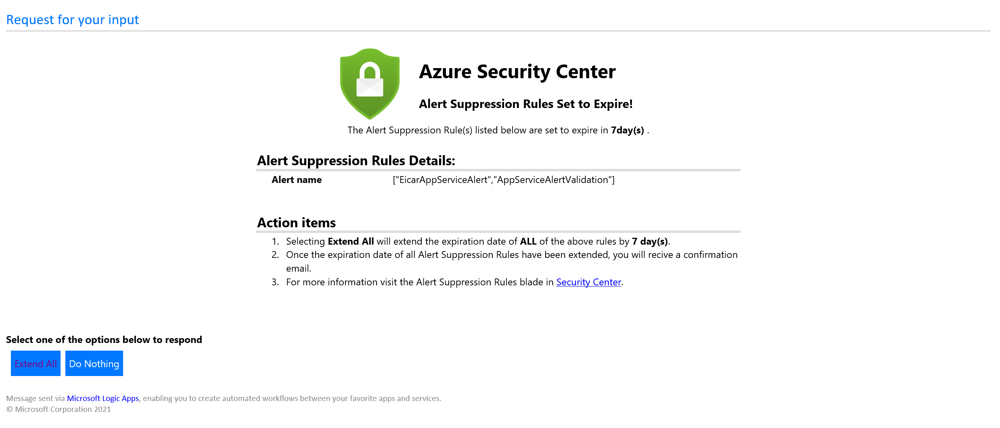
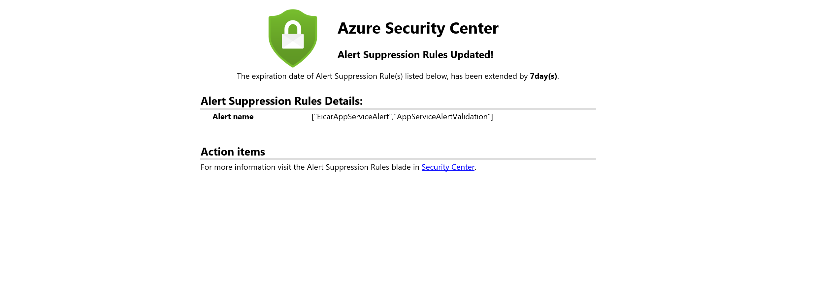

# Extend-AlertSuppressionRulesAboutToExpire

**Author(s)**: Bojan Magusic/Liana Tomescu/Prasad Patil

**Contributor(s)**: Safeena Begum/Tom Janetschek/Yuri Diogenes

When this automation is executed it will automatically extend the expiration time of **all** Security Center Alert Suppression Rules (ASRs) that are about to expire.

**Logic Implemented:**

* By default the Logic App will leverage a scheduler to run once per day (frequency of which can be adjusted).
* It leverages the variable **timeUntilExpiration**, which contols how many days ahead as of today, should the Logic App consider the current expiration date of ASRs, as being about to expire. By default this variable is set to 7 days (value of which can be adjusted during deployment).
* It leverages the variable **extendExpirationBy**, which contols by how many days for the ASRs that are about to expire, should the current expiration date be extended. By default this variable is set to 7 days (value of which can be adjusted during deployment).
* It then leverages the Subscriptions REST API to retrieve a list of all subscriptions within a management group.
* For each subscription, returned as a result from the previous step, it leverages the Alert Suppression Rules REST API to get a list of ASRs (that are not disabled).
* For each ASR, returned as a result in the previous step, it then checks if the current expiration date of that ASR is less or equal to the timeUntilExpiration variable (in days). For the ones that are, the Logic App will consider these ASR's as being about to expire.
* Should the number of ASRs that are about to expire be greater than zero, an approval email will be sent out to the (recepient and sender address both can be modified during deployment).  

* By selecting the **Extend All** option in the approval email, **ALL** of the ASRs which were indetified as about to expire, will have their current expiration date extended by the amount of days specified in the extendExpirationBy variable.  
* Once the expiration date of all ASRs have been extended, a confirmation email will be sent (leveragng the recepient and sender address that were specified during deployment).

**Deploy the template by clicking the respective button below.**

**Additional Post Install Notes:**

The ARM template will create the Logic App Playbook and API connection to Office 365. In order to deploy the automation, your account needs to be granted **Contributor** rights on the target Subscriptions. Note that you can assign permissions only if your account has been assigned **Owner** or **User Access Administrator** roles. Also, ensure that all selected subscriptions are registered to Azure Security Center. Additionally, you need to **authorise the Office 365 API connection** for the sender’s mailbox, from which the approval and confirmation email will be sent.

**To assign Managed Identity to specific scope:**

1. Make sure you have User Access Administrator or Owner permissions for this scope.
2. Go to the subscription/management group page.
3. Press Access Control (IAM) on the navigation bar.
4. Press +Add and Add role assignment.
5. Select the respective role.
6. Assign access to Logic App.
7. Select the subscription where the Logic App was deployed.
8. Select Extend-AlertSuppressionRulesAboutToExpire Logic App.
9. Press save.

**To authorise API connection:**

1. Go to the Resource Group you have used to deployed the template resources.
2. Select the Office365 API connection and press Edit API connection.
3. Press the Authorize button.
4. Make sure to authenticate against Azure AD.
5. Press save.
